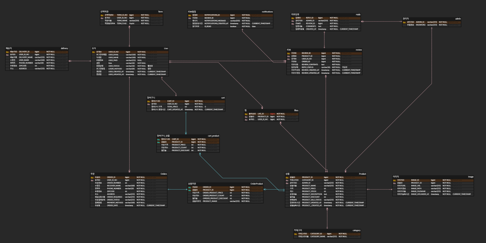

# 프룻 프룻 쇼핑몰 - 어드민 서버 🍎

 

---
## 🛠 사용 기술 스택

📌 BackEnd
 
 

 

 
 

📌FrontEnd
 
 

 

 

---
## 💿 프로젝트 기능

- #### ️👨🏻‍🔧 관리자
|    기능    |              설명              |                               비고                               |
|:--------:|:----------------------------:|:--------------------------------------------------------------:|
|   상품등록   |       판매하고자 하는 상품을 등록.       |     상품명, 분류, 가격, 할인율, 수량, 대표이미지,  상품 상세 설명(텍스트 및 이미지)      |
|   상품관리   |     판매등록한 상품들을 확인하고 관리.      | 조건별(판매상태, 분류, 상품명) 검색으로 조건에 맞는 상품 확인. 상품 수정 및 상품 판매 중지 가능. |
|   리뷰관리   | 구매자들의 리뷰를 관리하고 해당 리뷰에 답글 작성. |                  답변상태별, 리뷰작성기간별, 검색조건별 조회 가능.                  |
| 리뷰 답글 알림 |  구매자의 리뷰에 답글을 달 시 알림 메시지 전송  |                  답글 작성 이벤트 발생 시 Kafka로 메시지 전송                  |
 

---
## 📋 ERD
👉🏻 **ERD 링크 바로가기 :** https://www.erdcloud.com/d/N33PiySjCTmbMZxTq
